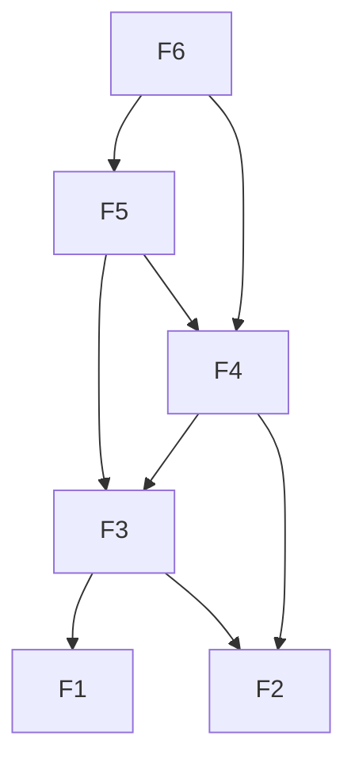
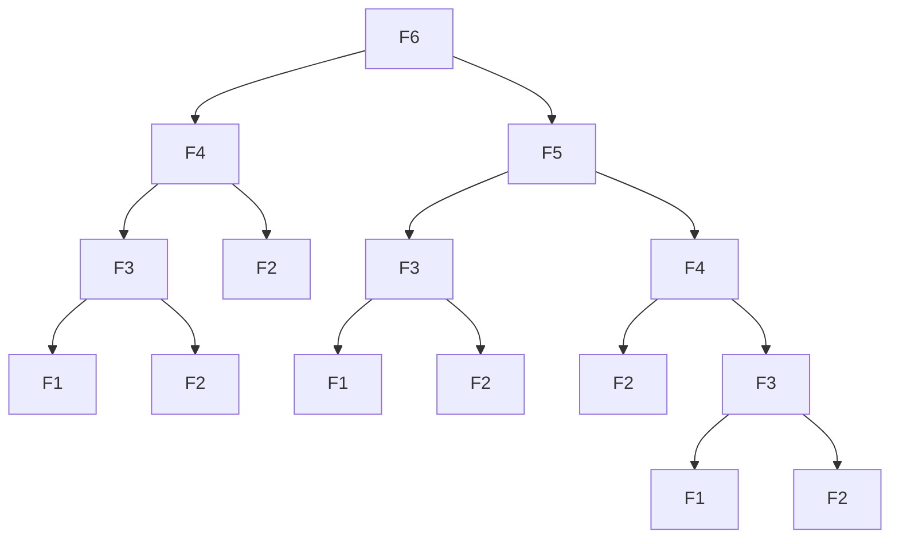

# Big O

Cómo crece f(x) según x crece. Ej: si tenemos 4x² + 7x + 3 -> O(n²). Queremos saber el uso de tiempo y memoria.

Comunes:

||||
|-|-|-|
O(1)|contant|array lookup|
|O(log n)|log time|binary search|
|O(n)|linear|find in unsorted array (radix sort)|
|O(n * log n)| quasilinear|comparison sort (merge sort)|
|O(n²)|quadratic|bubble sort|


# Dynamic Programming

1. La solución óptima es una combinación de las soluciones óptimas a los subproblemas.
2. Los subproblemas deben ser deterministas y deben tener solape (resolver los mismos problemas una y otra vez).
   
   - Memoization: guardamos el retorno de la función para reutilizarlos cuando la llamamos con los mismos params.
   - Tabulación;: misma idea, cachemaos resultados mediante (bottom up)
   - Top-down vs Bottom-up: un gran problema hecho de problemas más pequeños que requieren ser solucionados primero **vs** empezamos resolviendo problemas pequeños para faciliar problemas más complejos. Por lo general esto equivale a **recursividad** vs **iterativo**.

---
### Requirements
Dynamic Programming
- Must have a recurrence relation
   - Function must be pure: no side effects
- Recurrence Relation < Recursive Execution
### Time Complexity
**(# Unique States) * (Cached Complexity)**
- \# Unique States
   - Size of recurrence relation
   - Usually the product of parameter bounds
- Cached Complexity
   - What's the time complexity assuming recursive calls are O(1)?
### DP = Decision Parameterization
- Decisions are values to compute once 
- Decisions are not tasks to run every time 
- More Parameters -> Higher Runtime
- Minimize the parameters needed for a decision 
- Minimize the time to complete the decision

Technique -> More Technique

#### Main Ideas:
   
   Recurrence relation != Recursive execution

   A recurrence relation is a mathematical construct. 
   - It does not have side effects
   - It does not "compute" anything
   - It does not require recursive execution
   - It's just is a relationship between states

   Dynamic programming:
   - Decomposes problems with recurrence relations 
   - Recursive terms are values calculated once 
   - Evaluates in a valid order of dependencies

Consider this:
   The US Secretary of Defense was scared of math, so Richard Bellman created a name to hide the math. I wasn't joking it really is all just one big conspiracy.

---
Bottom-up Dynamic programming: los valores de entrada van disminuyendo progresivamente.

Un problema resolvible mediante dynamic programming debe tener dos propiedades:
- Overlapping subproblems: soluciones al un mismo problema son necesarias múltiples veces. Común con Divide and Conquer.
- Optimal Substructure: 

"Recursive terms are values, not tasks."

Recurrence Relation 


Recursive Execution


## Cuantas soluciones monedas
Cómo garantizar que no hay duplicados? Elegir solamente monedas superiores a la actual. 
Con las monedas ordenadas en la lista, solamente podemos incrementar el índice de la moneda que estamos usando.
```
   O
 / | \
1  2  5
```

Combinaciones posibles. Empezando en 5x1

| |5|4|3|2|1|0|
|-|-|-|-|-|-|-|
1|4|3|2|2|1|1
2|1|1|0|1|0|1
5|1|0|0|0|0|1

Cuantas formas de sumar 1 con moneds de 5? 1 - 5 = -4. Menos cuatro está fuera de la tabla así que hay 0 maneras.
Necesitamos toda la tabla en memoria si recorremos las celdas de izq a derecha.<br>
Recorreindo las celdas  ab-drch a arr-izq, solamente necesitamos dos filas en memoria, consiguiendo O(n) ya que nunca miramos más abajo que la fila siguiente.

Ej:
<br>moneda:2 cantidad:2
<br>Desplazamos dos celdas a la drch. hay un 1. Celda de abajo, hay un cero = Hay una solución
<br>
<br>moneda:1 cantidad:4
<br>Desplazamos una celda a la drch. hay un 2. Celda de abajo, hay un 1 = Hay 3 soluciones

Similar: [0/1 Knapsack problem](https://www.javatpoint.com/0-1-knapsack-problem)

## Interleaving strings
Si ambos strings contienen una letra válida, cómo decidimos cual coger? **Backtracking**.
<br>
Solo hay que hacer un seguimiento de qué índice de los strings originales usamos. Cuando toque hacer una decisión hay que ver si podemos completar el resto del string con lo que nos queda (True o False, un True es suficiente).

s1 = aabcc
s2 = dbbca
s3 = aadbbcbcac

Condición: podemos crear el final del string con los últimos caracteres de los strings de entrada? T=True, F=False
|||0|1|2|3|4||
|-|-|-|-|-|-|-|-|
| | |d|b|b|c|a||
1|a||||||
2|a||||||
3|b||||||
4|c||||||
5|c||||||
||||||F|F|T|

Los valores fuera de la tabla indica que hemos quedado sin caracteres en alguno de lo strings.

## 0/1 Knapsack
#### Bottom-up:

weight: [1, 2, 3]<br>
profit: [10, 15, 40]<br>
Capacity: 6


Considerando solo el 1er item, solo vale su propio valor con su peso

Para el segundo item...
- Con weight[j] = 2, el profit máximo es max(10, DP[1][2-2] + 15) = 15
- Con weight[j] = 3, el profit máximo es max(DP[1][3], 15 + DP[1][3-2]) = max(10, 25) = 25

Para el tercer item...
- Con weight[j] = 3, el profit máximo es max(DP[2][3], 40+DP[2][3-3]) = max(25, 40) = 40.
- Con weight[j] = 4, el profit máximo es max(DP[2][4], 40+DP[2][4-3]) = max(25, 50) = 50.
- Con weight[j] = 5, el profit máximo es max(DP[2][5], 40+DP[2][5-3]) = max(25, 55) = 55.
- Con weight[j] = 6, el profit máximo es max(DP[2][6], 40+DP[2][6-3]) = max(25, 65) = 65.

| |0|1|2|3|4|5|6|
|-|-|-|-|-|-|-|-|
0|0|0|0|0|0|0|0|
1|0|10|10|10|10|10|10
2|0|10|15|25|25|25|25
3|0|10|15|40|50|55|65

## Memoization en Fibonacci
`
fib(n) = fib(n-1)+fib(n-2)
`
```
         n
       /   \
    n-1     (n-2)
    /  \         / \
 (n-2) [n-3] [n-3]  n-4
```
## LRU Cache
[LRU Cach implementation](https://www.geeksforgeeks.org/lru-cache-implementation/)

Python:
```
from functools import lru_cache

@lru_ache
def func:
   pass
```